# 第一章 shell介绍

## 1.shell

Shell 是指一种应用程序，俗称壳（用来区别于核），由 C 语言编写，它接收用户输入的命令，然后调用其他程序相应的程序。Shell 既是一种命令语言，又是一种程序设计语言。


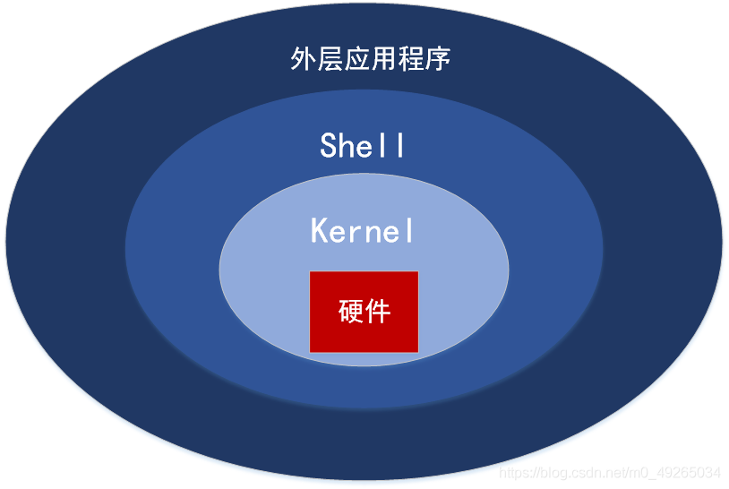


## 2.Shell 命令

shell设计了一些命令，我们将这些命令通过终端发送给它，它就会做出一些动作并把执行结果返回给我们。

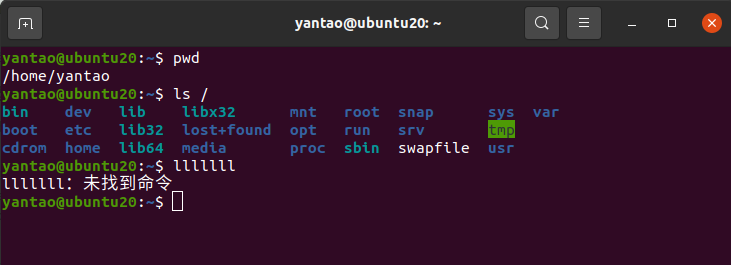


## 3.Shell 脚本

Shell 脚本（shell script），是一种为 shell 编写的脚本程序。

业界所说的 shell 通常都是指 shell 脚本，但读者朋友要知道，shell 和 shell script 是两个不同的概念。

由于习惯的原因，简洁起见，本文出现的 "shell编程" 都是指 shell 脚本编程，不是指开发 shell 自身。


## 4.Shell 的种类

- Bourne Shell（/usr/bin/sh或/bin/sh）
- Bourne Again Shell（/bin/bash）
- C Shell（/usr/bin/csh）等等

可以通过 

**cat /etc/shells** 命令来查看系统的shell种类。

**echo $SHELL** 命令来查看当前使用的shell，如图所示我们当前使用的shell是bash，那么输入的所有命令都是由bash处理的。

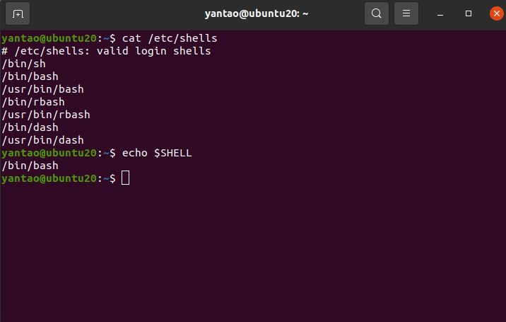


## 5.shell 的历史

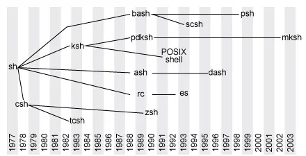

### Unix与shell

1970年，Kenneth Thompson(贝尔实验室)和Dennis Ritchie(贝尔实验室) 使用汇编语言开发的UNIX系统投入运行。

1971年，Ken Thompson为UNIX开发了第一种shell，称为V6 shell。这个版本shell的缺陷在于脚本编程能力的不足，它只是一个交互性的命令解释器。

1972年，DennisRitchie开发出C语言，用来重写了UNIX，由此产生了UNIX VersionV。

1977年，Stephen Bourne在贝尔实验室使用C语言为V7 UNIX开发了Bourne Shell，bshell一直沿用至今。


### Linux与bash 

1989年，Brian Fox(贝尔实验室)开发了Bourne-Again Shell，即bash，是GNU的项目，旨在替换Bourne Shell。之后bash成为了在Linux上最流行的shell，并成为许多Linux发行版默认的交互式shell。


### 扩展阅读

#### ash

1989 年，Almquist(贝尔实验室)开发的ash发布，是unix的shell，具有 System V shell 的大部分功能。ash 速度快、体积小，它非常适合内存较低的机器，但是功能没有shell全。后来ash又有了很多衍生版本，被安装在FreeBSD、NetBSD等Linux的发行版上，作为默认 shell (/bin/sh) 。

#### dash

1997 年，Herbert Xu 将 Ash 从 NetBSD 移植到 Debian Linux。

2002 年 9 月发布 0.4.1，该端口被重命名为 Dash（Debian Almquist shell）

2006 年，Ubuntu 决定采用 Dash 作为默认的 /bin/sh，使用 Dash 的原因是 shell 脚本运行得更快，特别是在操作系统启动时。但是，交互式使用的默认登录 shell 仍然是 Bash。

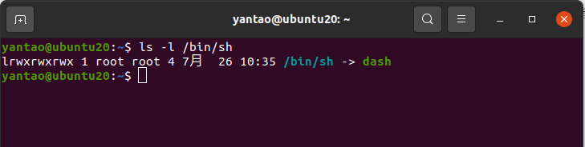

Ash（主要是 Dash 分支）在嵌入式 Linux 系统上也很流行。 Dash 版本 0.3.8-5 内置于 BusyBox中，并可与 DSLinux、Alpine Linux、Tiny Core Linux 以及基于 Linux 的版本（例如 OpenWrt、Tomato 和 DD）配合使用。

#### ksh

1983年，Korn(贝尔实验室)发布了Korn shell，基于Bourne shell的源代码发展而来，KornShell是向后兼容的Bourne Shell。

#### mksh

 Android 在 Android 4.0 之前使用 Ash，但在 Android 4.0 之后改用 mksh。


# 第二章 走进shell

## 1.扩展阅读

今天的个人计算机包含了主机、键盘和显示器，但是计算机最初不是这个样子的。

终端


终端 tty (Teleprinter)

 https://zhuanlan.zhihu.com/p/108206742

http://www.linusakesson.net/programming/tty/

https://zhuanlan.zhihu.com/p/53300998

https://www.zhihu.com/question/21711307

https://zhuanlan.zhihu.com/p/608891209

伪终端 pty (Pseudo Terminal)

https://zhuanlan.zhihu.com/p/42771810

https://unix.stackexchange.com/questions/4126/what-is-the-exact-difference-between-a-terminal-a-shell-a-tty-and-a-con


## 2.进入命令行

在图形化桌面出现之前，与Unix系统进行交互的唯一方式就是借助由shell所提供的文本命令行界面（command line interface，CLI）。

CLI只能接受文本输入，也只能显示出文本和基本的图形输出。

### 1.控制台终端

打开服务器版本的Linux，就会进入文本模式。这样在显示器上就只有一个简单的shell CLI。这种模式称作Linux控制台，因为它仿真了早期的硬接线控制台终端。


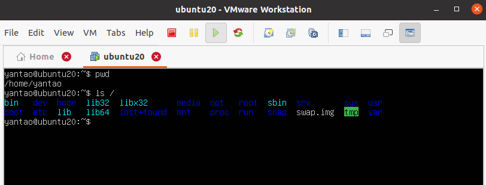


### 2.图形化终端

在桌面版Linux中的，有很多的终端仿真包。终端仿真包会在一个桌面图形化窗口中模拟控制台终端的使用。

​																													GNOME Terminal

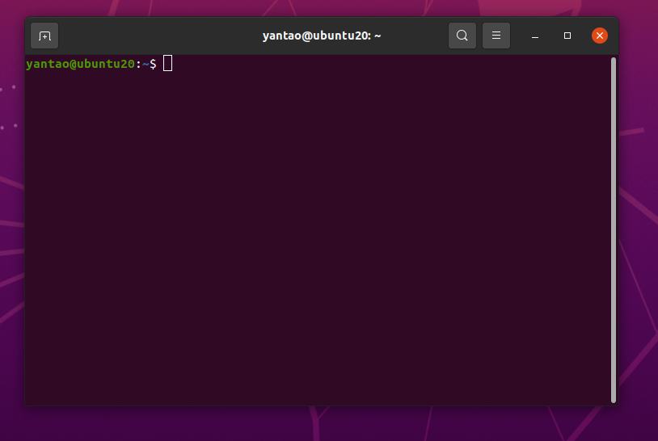


​																															Konsole

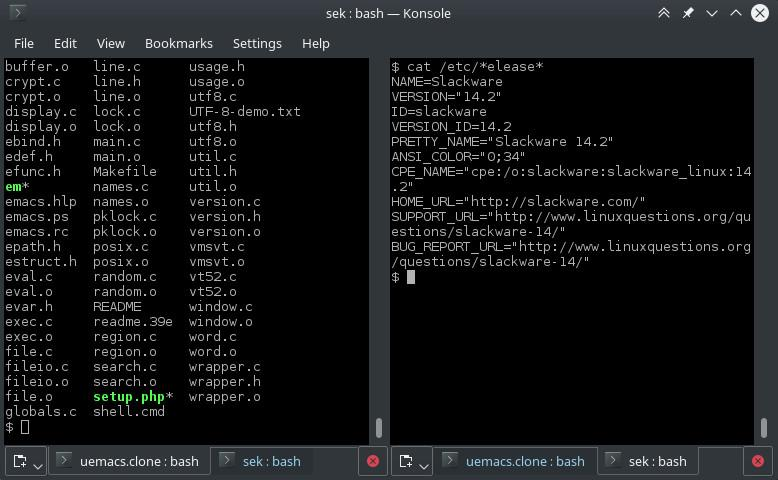


​																															rxvt 

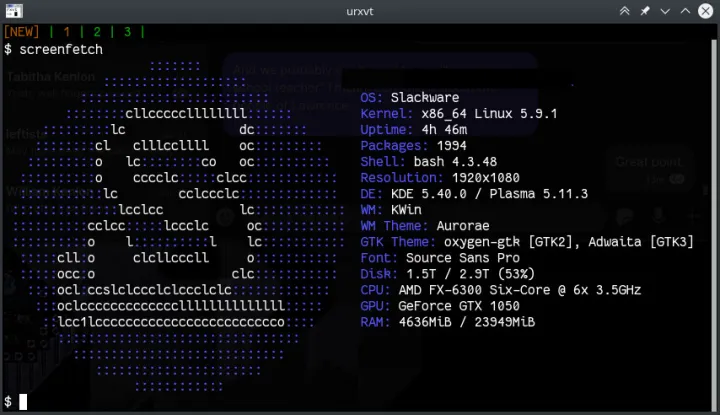

还有很多其他版本的图像化终端。


# 第三章 基本的bash shell命令

## 1.启动 shell

bash shell能提供对Linux系统的交互式访问。它是作为普通程序运行的，通常是在用户登录终端时启动。

前面说到shell有很多种，登录时系统启动了那种shell依赖于用户账户的配置。

/etc/passwd文件包含了所有系统用户账户列表以及每个用户的基本配置信息。

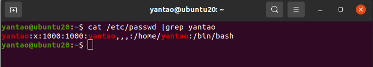

## 2.bash手册

man命令用来访问存储在Linux系统上的手册页面。

```shell
man ls
```

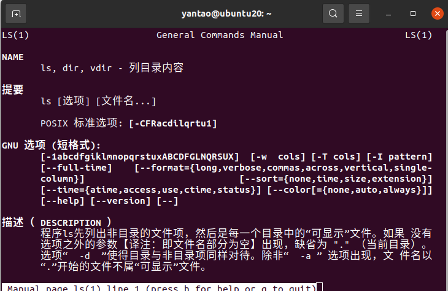

```shell
man echo
```

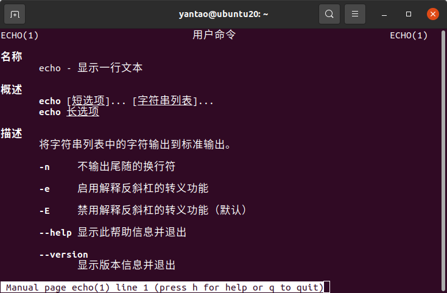

man本身也有说明

```shell
man man
```

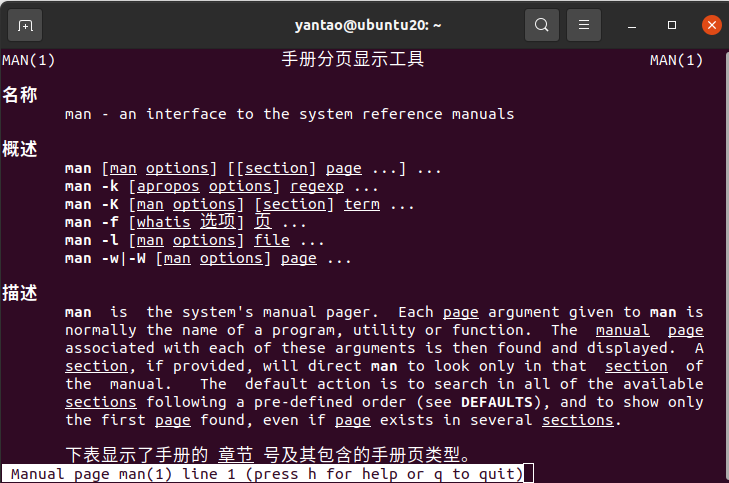


